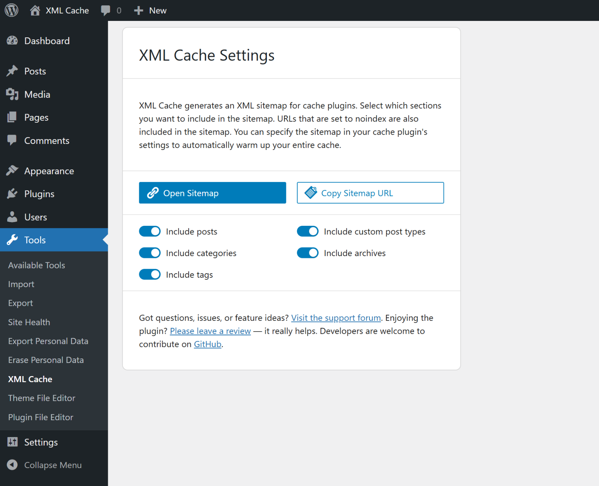
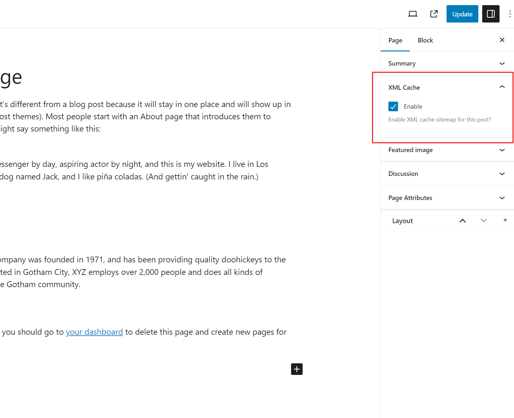

# XML Cache

A lightweight WordPress plugin that generates an XML sitemap tailored for cache warming. Perfect for caching plugins like LiteSpeed Cache: the sitemap includes all relevant pages — including paginated archives — so your cache can warm up completely and fast.

## Features
- Single sitemap for cache warming at `/cache.xml`.
- Includes posts, pages, categories, tags, archives, and public custom post types — with pagination.
- Enable/disable each section (posts, pages, categories, tags, archives, CPTs) in the plugin settings.
- Per-post/page opt-out via meta box.
- Admin screen with "Open Sitemap" and "Copy link".

## Requirements
- WordPress ≥ 6.0
- PHP ≥ 8.2 (due to Symfony 7.x dependencies)

## Install & Use
- Install via "Plugins > Add New" or upload the ZIP and activate.
- Configure under "Settings > XML Cache"; open/copy the sitemap from there.
- The sitemap is available at `/cache.xml`.

## Screenshots

## Support & Feedback
Found a bug or have a feature request? Please open an issue on GitHub.

## License
GPL-3.0-or-later. See the license header in the plugin file.